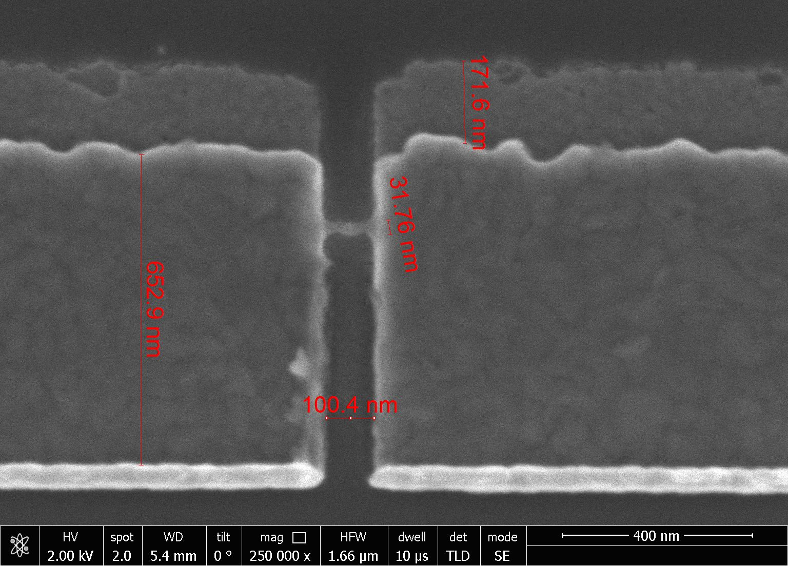
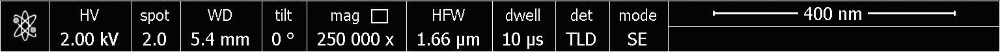
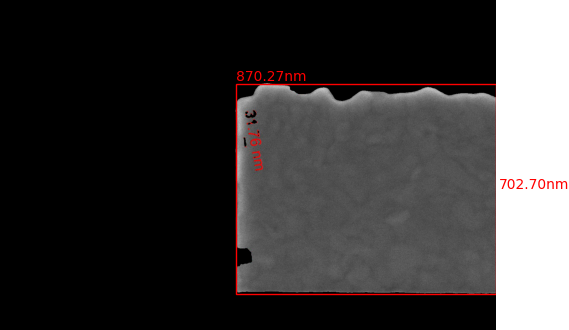
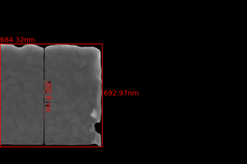
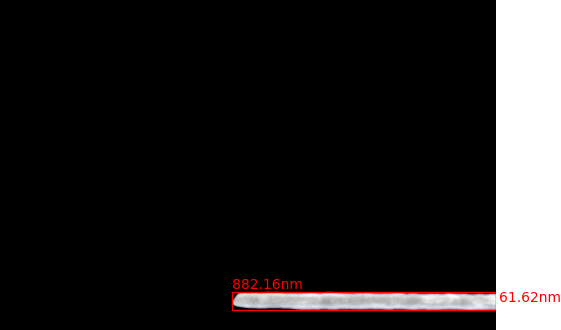
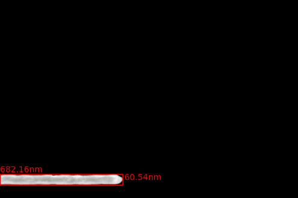
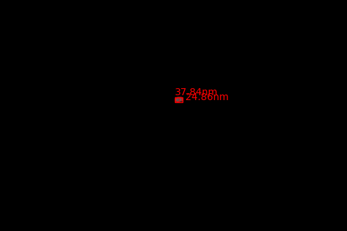

# SEM Image Analyzer

This program is designed to analyze Scanning Electron Microscope (SEM) images, specifically images of superconducting quantum devices. It uses the [Segment Anything library from Meta](segment-anything.com/demo) to identify and segment objects in the image.

## Features

- Takes an SEM image as input and generates masks for all objects in the image.
- Displays each mask with a bounding box and the dimensions of the bounding box in nanometers.
- Saves each masked image in a directory structure: `results/name of input image/mask#_date created`.
- Extracts the scale from the image and converts it to nanometers, regardless of the original unit.

## How It Works

The program works in several steps:

1. **Input SEM Image**: The user provides an SEM image as input. Here is an example of an input image:

    

2. **Extract Scale**: The program crops the bottom 80 pixels of the image, which contains the scale. It then uses OCR to extract the number and unit of the scale. Here is an example of the extracted scale:

    

3. **Generate Masks**: The program uses the Segment Anything library to generate masks for all objects in the image. It then sorts the masks by area and displays each mask with a bounding box. The dimensions of the bounding box are calculated in nanometers based on the extracted scale.

    Here are examples of the masks generated for the main features in the image:

    
    
    
    
    

4. **Save Images**: The program saves each masked image in the `results/name of input image/` directory. The images are named according to the mask number and the date created.

## Usage

1. Run the program.
2. When prompted, enter the path to the SEM image you want to analyze.
3. The program will generate masks for all objects in the image and save the masked images in the `results/name of input image/` directory.

## Requirements

- Python 3.7 or later
- Segment Anything library from Meta
- OpenCV
- PyTesseract
- Matplotlib
- NumPy
- PIL

## Installation

1. Install Python 3.7 or later.
2. Download the [checkpoint file from Meta](https://github.com/facebookresearch/segment-anything#model-checkpoints) and store them in the `weights` subdirectory and update the corresponding line in the main file
```python
# Load the model
sam = sam_model_registry["vit_h"](checkpoint="weights/<checkpoint_file_name>")
```

2. Install the required Python libraries. You can do this by running `pip install -r requirements.txt` in your terminal.
3. Clone this repository to your local machine.

## Work In Progress:

- [ ] a GUI for this code
- [ ] Batch Mode for bulk image processing (parallelized and GPU run process)
- [ ] Intelligent feature detection based on single shot supervised training for batch mode analysis

## Contributing

Contributions are welcome. Please open an issue to discuss your ideas or submit a pull request with your changes.

## License

This project is licensed under the MIT License. See the `LICENSE` file for details.

